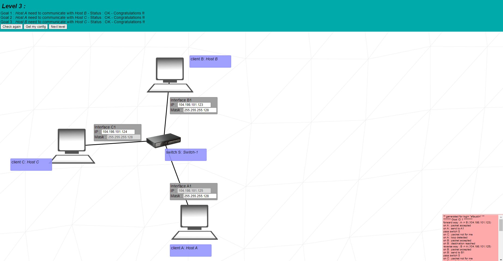

# Net Practice

* [Introduction](#introduction)
* [Notion](#notion-link)
* [The Project](#the-project)

## Skills that I have improved
* Network & system administration
* Rigor

## Introduction
* This project is a general practical exercise that let me discover networking.

## The project
In order to succeed in doing this project I had to master the following:
* TCP/IP Addressing
* Subnet mask
* IP Classes
* Routing

  
Exercise 01

  
   
  
  Solution
   
  * `104.95.23` is the first network IP
  * _Client A_ and _Client B_ are on the same network so they need to have the same network IP
  * The host interval for the mask `255.255.255.0` is `1 to 254`. The host part of _Client A_  IP need to be on this interval
  * Repeat the logic for _Client D_

  
Exercise 02

  
   
  
  Solution
   
  * The submask of _Interface A1_ is `255.255.255.224`
  * _Interface B1_ is on the same network as _Interface A1_, because of this both devices need to have the same submask
  * The IP of Interface B1 is `192.168.62.222`, then all devices that need to communicate with _Interface B1_ through the same network need to have an IP ranging from `192.168.62.192`to `192.168.62.221`
  * The submask on the network that connects _Interface C1_ and _Interface D1_ is configurated, then everything that is asked to do is to set up the IP from both devices
  * Because the submask of the network is `255.255.255.252` there are two availables hosts per sub-net

  
Exercise 03

  
   
  
  Solution
   
* The IP of _Interface A1_ is `104.198.101.125` and the sub mask of _Interface C1_ is `255.255.255.128`
* IP range for devices of this network is `104.198.101.1` to `104.198.101.126` due to the information that the exercise gave

  
Exercise 04

  
   
  
  Solution
   
  * Firstly, get a sub mask that will give a IP range that will not overlap Interface R3 and Interface R2. In my case I got 255.255.255.240 so the IP range will be `192.181.114.129` to `192.181.114.142`
  * Set up _Interface R1_ and _Interface R2_ with the chosen sub mask and IP range

  
Exercise 05

  
   
  
  Solution
   
* There are two different networks and the router intermediate the communicate between them
* This exercise adds a _route table_ and for now we just need to inform the _next hop_
* On the _Client B_ table is necessary to inform the IP of _Interface R2_
* On the _Client A_ table is necessary to inform the IP of _Interface R1_
* The exercise already gave the network IP for _Interface B1_ and _Interface A1_
* _Interface B1_ belongs to the same network of _Interface B2_ so it will need to have the same Network IP but with a different host number
* _Interface A1_ belongs to the same network of _Interface R1_ so it will need to have the same Network IP but with a different host number

  
Exercise 06

  
   
  
  Solution
   
* This exercise adds a connection with the internet.
* It's necessary to inform the network IP and the Submask on the slash notation format on the Internet Route Table. On this case it will be `61.41.198.128/25`.
* Others fields need to be filled as the previous exercises

  
Exercise 07

  
   
  
  Solution
   
* The IP of _Interface A1_ is `104.198.101.125` and the sub mask of _Interface C1_ is `255.255.255.128`
* IP range for devices of this network is `104.198.101.1` to `104.198.101.126` due to the information that the exercise gave

  
Exercise 08

  
   
  
  Solution
   
* The IP of _Interface A1_ is `104.198.101.125` and the sub mask of _Interface C1_ is `255.255.255.128`
* IP range for devices of this network is `104.198.101.1` to `104.198.101.126` due to the information that the exercise gave

  
Exercise 09

  
   
  
  Solution
   
* The IP of _Interface A1_ is `104.198.101.125` and the sub mask of _Interface C1_ is `255.255.255.128`
* IP range for devices of this network is `104.198.101.1` to `104.198.101.126` due to the information that the exercise gave

  
Exercise 10

  
   
  
  Solution
   
* The IP of _Interface A1_ is `104.198.101.125` and the sub mask of _Interface C1_ is `255.255.255.128`
* IP range for devices of this network is `104.198.101.1` to `104.198.101.126` due to the information that the exercise gave

